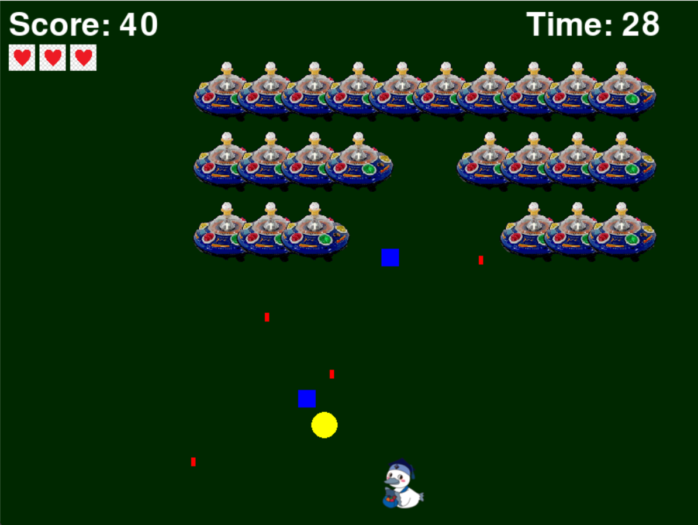

# こうかとんシューティング

## 実行環境の必要条件
* python >= 3.10
* pygame >= 2.1

## ゲームの概要
プレイヤーはこうかとんを操作して、上から降ってくるUFOをビームで打倒します。
敵の弾に当たるとライフが減りライフが０になるとゲームオーバーです。
制限時間は３０秒で、その愛でに出来るだけ多くの敵を倒しスコアを稼ぎましょう！！！！
* 主人公キャラクターこうかとんをキー操作により敵を倒しスコアを競うゲーム。
* 参考にしたサイト：[インベーダーゲーム](https://python.joho.info/pygame/pygame-invader/)

## ゲームの遊び方
* S:スタート
* R:ゲームオーバー時にリスタート
* 黄色のアイテムは強化アイテム：無敵になります！！！！！！！
* 碧色のアイテムは弱体化アイテム:弱体化しちゃいます(足が遅くなります！！)
* 矢印キーでこうかとんを操作し，スペースキー押下によって敵を倒します
* こうかとんが敵の攻撃に当たったら，ゲームオーバーとなります

## ゲームの実装
### 共通基本機能
* 背景画像と主人公キャラクターの描画
* ビームを撃つ
* 敵とビームの衝突判定
* スコアの表示
* スタート、リスタート

### 分担追加機能
* ランク機能（担当：田中優希）：スコアによるランク機能（S～E）
* ライフ制（担当：堀内遥斗）：操作キャラにヒットポインを追加する
* 制限時間（担当：望月蓮理）：制限時間の実装（３０秒）
* アイテム機能（担当：安藤匠真）：アイテムの取得によりこうかとんが無敵になる
* アイテム機能（担当：澤佳輔）：アイテムの取得によりこうかとんが弱体化

### ToDo
効果音の追加
ウェーブ制
### メモ

